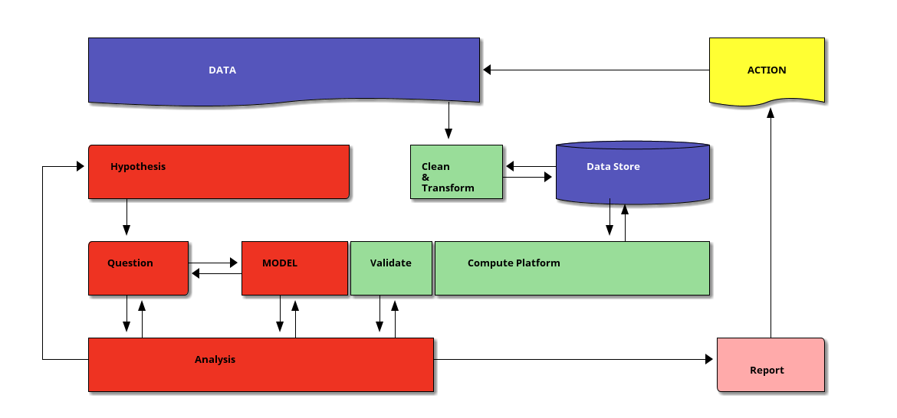

## Welcome to MAT388E

### Data Science for Fundamental Sciences

### Focus

A *hands-on* practical introduction to machine learning algorithms.

- supervised and unsupervised learning,
- validation and error analysis, 
- clustering and classification algorithms,
- regression algorithms,
- neural networks and related subjects.

### Objectives

- to understand the fundamental concepts and algorithms
- to learn use cases of supervised and unsupervised algos
- to gain practical know-how on basic ML algorithms
- to learn how to apply ML algorithms to problems
- to learn how to analyze results

### Books

The following books are freely available on the web.

* T. Hastie, R. Tibshirani, and J. Friedman.  [*The Elements of Statistical Learning.*](https://www.sas.upenn.edu/~fdiebold/NoHesitations/BookAdvanced.pdf)
* M. P. Deisenroth, A. A. Faisal, and C. S. Ong. [*Mathematics For Machine Learning*.](https://mml-book.github.io/book/mml-book.pdf)
* I. Goodfellow, Y. Bengio, and A. Courville. [*Deep Learning*.](https://www.deeplearningbook.org/)

### Other resources

For the computational homeworks you may need the following:

- A. Müller and S. Guido *Introduction to Machine Learning with Python: A Guide for Data Scientists 1st Edition*.
- A. Geron. *Hands-On Machine Learning with Scikit-Learn, Keras, and TensorFlow Concepts, Tools, and Techniques to Build Intelligent Systems*
- J. VanderPlas, *Python Data Science Handbook*.

### Who am I?

Originally theoretical math (algebra) turned data analyst by demand

- statical data analysis
- time series analysis
- text analysis
- topological data analysis

## Syllabus and Assessment

### Overview of the Syllabus

### Assessment

- 4 homework projects 
- final proposal (1500 words)
- final project (5000 words)

### Homeworks

- 4 homework projects
- each HW will have 4-5 questions
- contains both coding and analysis
- submit via github 
- deadline date at 11:59PM

### The Final Proposal

- dataset(s) with detailed description
- questions you ask the dataset(s)
- methods you are going to use
- list of team members
- division of labor (who will do what)

### The Final Project

- dataset(s)
- hardware and software
- question(s)
- methods to extract answers from the dataset(s)
- obstacles and solutions
- analysis (what, why, how)
- workload breakdown (who, what, how much work)

### Use of LLMs

I allow and even encourage students to large language models (ChatGPT, Claude2, LLAMA2 etc).

Your required to document the usage through logged transcripts.

Transparency and maintaining academic integrity.

## The Tools

### Python 

- Popular open source programming language
- Flexible language good for beginners
- Widely used in industry and research
- Many libraries for data analysis 
  + Pandas, 
  + Numpy, 
  + Scikit-Learn etc.

### Jupyter Notebooks

Notebooks are ideal for constructing a coherent narrative analysis of data because

- Interactive
- Versatile (many languages) [JU](https://julialang.org/)(lia)[PYT](https://www.python.org/)(hon)e[R](https://www.r-project.org/)
- Supports code, text, and visualization in the same context

### Package Managers

Package manager manages the libraries installed on your system:

- [anaconda](https://docs.conda.io/en/latest/)
- [pip](https://pypi.org/project/pip/)

### Online Compute Platforms

* [CoCalc](https://cocalc.com/) 
* [Google Colab](https://colab.research.google.com/)
* [Microsoft Azure Notebooks](https://visualstudio.microsoft.com/vs/features/notebooks-at-microsoft/)
* [Kaggle](https://www.kaggle.com/)

### Git

Git is a version control system. [(Image source)](https://github.com/crc8/GitVersionTree)

### GitHub

GitHub is a sharing platform. [(Image source)](https://support.nesi.org.nz/hc/en-gb/articles/360001508515-Git-Reference-Sheet)

### Markdown

[Markdown](https://en.wikipedia.org/wiki/Markdown) is a markup
language like HTML, but [much simpler](https://www.markdownguide.org/cheat-sheet/).

## Data Science

### What is Data?

Any collection of symbols can be data as long as they are

- recorded consistently
- collected within the same context
- recalled consistently and accurately

### What is Data Science?

- interdisciplinary field 
- extracts insights from data
- by fitting models on data

### Data Science Workflow

### Analysis Workflow

1. Look at the data, clean it, understand it.
2. Put forth a hypothesis.
3. Design a question to test the hypothesis.
4. Choose a model type.
3. Design a fit function.
4. Find the best fitting model parameters.
3. Validate the model using the fit function.
4. If necessary go back to step 2, 3 or 4.
5. Write a report.

### How is it different than Science?

In any science we do the same.

+ Our domain is fixed.
+ We need deep domain knowledge.
+ Our models are specific to that particular domain.

### How is Data Analysis different than Science?

* Data Analysis models use

  + internal structure of the data
  + are domain agnostic

* Developing these models requires
  - statistical
  - mathematical
  - computational skills
  
### Do we need all of this to do Data Analysis?

* No code no compute!
* No statistics no certainity!
* No mathematics no maintanence!

### Can anyone do Data Analysis without domain knowledge?

Any fool can develop a model! (coding) 

### Can anyone do Data Analysis without domain knowledge?

It is difficult to see/decide if

* a model fits (domain knowledge)
* when/where model stops working (math/stats)
* fixing a model when it breaks (math)

### What does a model do?

- Models can be 
  + predictive 
  + or descriptive.

### Why Models?

>  "All models are wrong, but some are useful." George Box

+ Data is usually noisy, complex and hard to understand.
+ Model is an artificial construct.
+ Model is a simplification.

## Applications

### Examples

- Use of data science in academia
- Movie recommendations on Netflix
- Targeted ads on social media
- Predictive maintenance for manufacturing

### A Hands On Example

